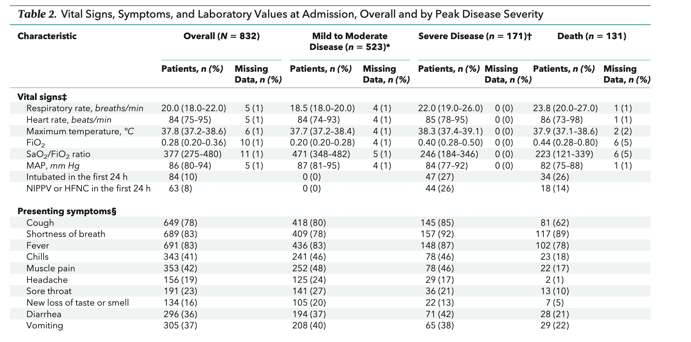
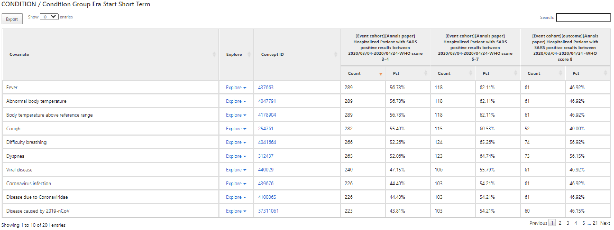

**This tutorial will guide you to create cohort Characterizations using ATLAS.**    

### 1. Create new Characterizations
```{r, echo=FALSE, fig.cap="New Characteriztions", fig.align = 'center'}
knitr::include_graphics("/Users/chenyuli/OMOP-CROWN/Manuals/CreateNewFeatures/1. New characterization.png")
```   

### 2. Design the Characterization analysis   
* Add Cohort definitions  
```{r, echo=FALSE, fig.cap="New Characteriztions", fig.align = 'center'}
knitr::include_graphics("/Users/chenyuli/OMOP-CROWN/Manuals/CreateNewFeatures/2. characterizations-import cohorts.png")
```     
* Import Feature analyses   
At this point we may need to import customized Feature Analysis follow the tutorial "Create new features.html" 
```{r, echo=FALSE, fig.cap="Import Features", fig.align = 'center'}
knitr::include_graphics("/Users/chenyuli/OMOP-CROWN/Manuals/CreateNewFeatures/3. import features.png")
```     

* Final DEsign of the characterization
```{r, echo=FALSE, fig.cap="Characterizations design", fig.align = 'center'}
knitr::include_graphics("/Users/chenyuli/OMOP-CROWN/Manuals/CreateNewFeatures/4. Characterization design for Annals paper.png")
```   
### 3. Excute the design 
Click Executions-> Generate -> View Report 
**Explore some results**  
```{r, echo=FALSE, fig.cap="Characterizations design", fig.align = 'center'}
knitr::include_graphics("/Users/chenyuli/OMOP-CROWN/Manuals/CreateNewFeatures/5. Three cohorts comparison .png")
```     


**Compare two cohorts ( e.g. Severe and Death cohorts)**

```{r, echo=FALSE, fig.cap="Two cohorts comparison", fig.align = 'default'}
knitr::include_graphics("/Users/chenyuli/OMOP-CROWN/Manuals/CreateNewFeatures/6. Severe&Death cohorts comparison.png")
```       


Short term condition comparison between Severe and Death Group  
```{r, echo=FALSE, fig.cap="Short Term Condition", fig.align = 'center'}
knitr::include_graphics("/Users/chenyuli/OMOP-CROWN/Manuals/CreateNewFeatures/7. short-term condition comparison.png")
```  
```{r, echo=FALSE, fig.cap="Short Term Device Exposure", fig.align = 'center'}
knitr::include_graphics("/Users/chenyuli/OMOP-CROWN/Manuals/CreateNewFeatures/short term device exposure.png")
```  
### 4. Compare the result with Garibaldi’s  paper 
 
