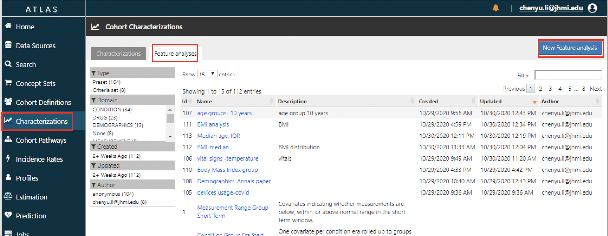
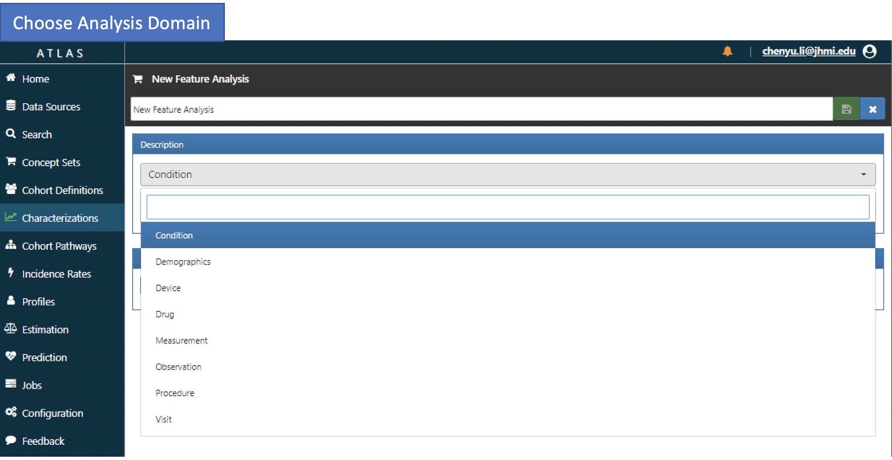
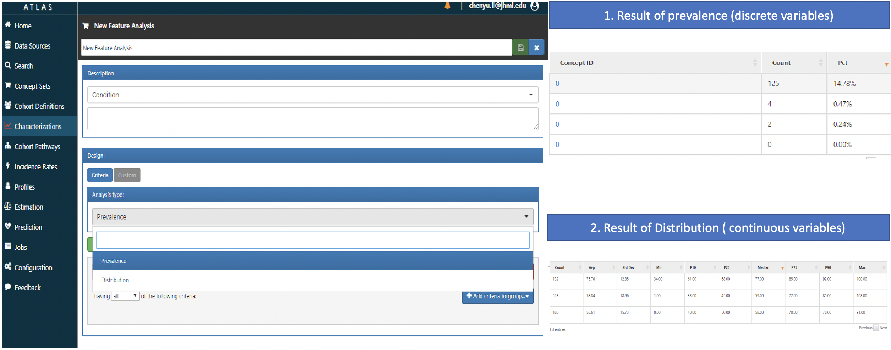
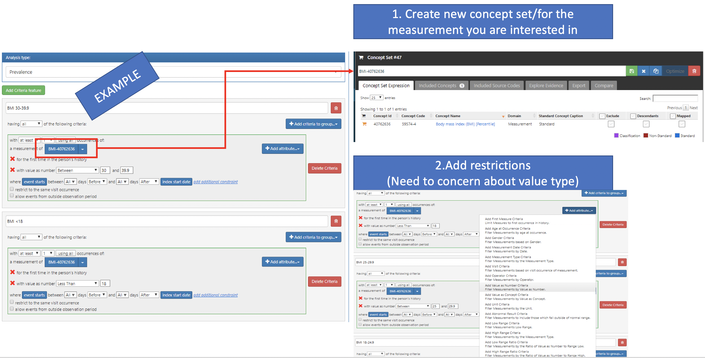
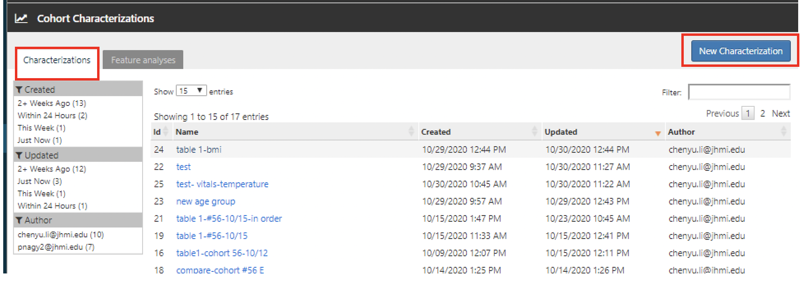
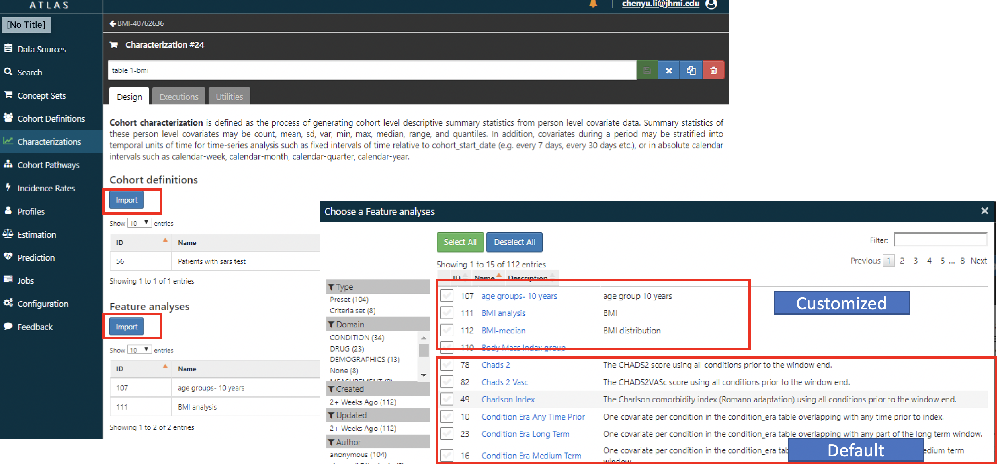
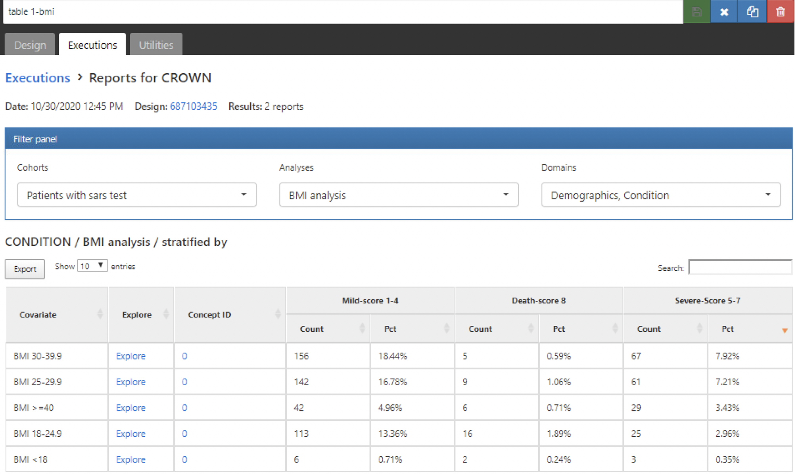

**This tutorial will guide you to create customized feature analysis for cohort characterization.**  
  
    
      
      
>Cohort characterization describes the baseline and post-index characteristics of people in a cohort. OHDSI approaches characterization through descriptive statistics of all conditions, drug and device exposures, procedures and other clinical observations that are present in the person’s history. We also summarize the socio-demographics of members of the cohort at the index date. This approach provides a complete summary of the cohort of interest. Importantly, this enables a full exploration of the cohort with an eye towards variation in the data while also allowing for identification of potentially missing values.   ---Book of OHDSI Chapter 11

>Cohort characterization methods can be used for person-level drug utilization studies (DUS) to estimate the prevalence of indications and contraindications amongst users of a given treatment. The dissemination of this cohort characterization is a recommended best practice for observational studies as detailed in the Strengthening the Reporting of Observation Studies in Epidemiology (STROBE) guidelines. (Elm et al. 2008) --Book of OHDSI Chapter 11


### 1.Click New Feature analyses tab

```{r,echo = FALSE}

```

### 2.Enter new analysis descriptions

* Change a new name for the analysis
* Add description
* Choose a domain for the analysis 
* Click the save icon 

```{r , echo = FALSE}

```

### 3.Choose the design for new analysis

* Prevalence for discrete variables
* Distribution for continuous variables

```{r, echo = FALSE}

```

### 4.Create design logic 

* If the measurement concept is not in a concept set, create a concept set for the measurement you are interested in.
* Add logic restrictions of the design.

```{r, echo = FALSE}

```


### 5.Create new characterization design 

* Click characterizations tab under cohort characterizations section

```{r, echo = FALSE}

```

### 6.Design your characterizations

* Change the name of the new characterization
* Import cohorts you are interested in 
* Import Feature Analyses. You can find standardized default analyses, and the new feature analysis you just created in this step.

```{r , echo = FALSE}

```


### 7.Excute the cohort characteristics design

* Save the design first.
* Change to executions tab.
* Click "Generate"
* See the cohort characterization result. 

```{r , echo = FALSE}

```